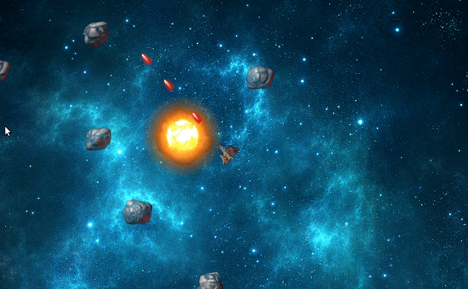

# Asteroid

Asteroid is a simple game written in C++ using Simple and Fast Multimedia Library (SFML) .


## Installation

```bash
sudo apt-get install libsfml-dev   # install the SFML library.
git clone https://github.com/RebatiGaire/Asteroid_game.git
cd Asteroid_game
g++ game.cpp -o game -lsfml-graphics -lsfml-window -lsfml-system -lsfml-audio
./game
```
